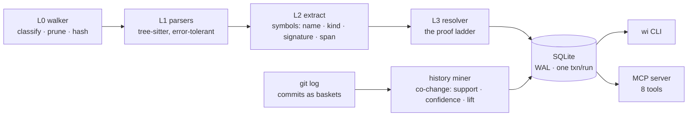

# wright-index

> *wright (n.) — one who builds or makes.*

**A code-intelligence engine for coding agents.** It indexes a repository once — symbols,
call graph, git history — then answers the questions grep cannot, over a CLI or as an
MCP server inside Claude Code (or any MCP client).

It is deliberately **not** an agent: no LLM in the hot path, no autonomy, no network.
It is the knowledge layer that makes an existing agent measurably better at the
questions grep cannot answer, on a codebase it has never seen.

| Question | Why grep can't answer it |
|---|---|
| *Who calls this function?* | Grep returns name collisions, not resolved callers. |
| *What breaks if I change it?* | Needs a call graph with transitive traversal. |
| *What else changes when this file changes?* | The answer isn't in the code — it's in commit history. HAMi's `ascend/device.go` and `mthreads/device.go` share no import, no symbol, no string; they co-change at 25x above chance. |
| *Which tests actually exercise this symbol?* | Needs evidence from call edges, not filename guessing. |

The design bet, and the thing this project treats as its product: **every answer carries
its evidence.** Each call edge stores *how* it was proven and at what confidence, and
when the resolver cannot prove a target for an extracted call site it records the
refusal instead of hiding it — so an agent acting on the graph can tell a proof from
a guess.

---

## Quickstart

```bash
pip install -e ".[dev]"        # Python ≥ 3.10

wi index path/to/repo          # build the index (~15 s per 70k lines, incremental after)
wi callers    path/to/repo trimMemory --depth 2    # who calls this, transitively
wi refs       path/to/repo Fit                     # every call site, proven or not
wi cochange   path/to/repo device.go               # what changes WITH this file
wi blast-radius path/to/repo Devices.trimMemory    # callers + coupled files + tests
wi tests-for  path/to/repo compute                 # tests exercising a symbol
wi hot        path/to/repo                         # churn leaders + de-facto owners
```

The index lives in `~/.wright-index/<repo>-<hash>.db` — indexing someone else's checkout
never dirties their `git status`.

### As an MCP server in Claude Code

```bash
wi index /path/to/repo
claude mcp add wright-index -- wi mcp /path/to/repo
```

Sessions then get eight tools — `repo_map`, `find_symbol`, `callers`, `refs`,
`blast_radius`, `cochange`, `covering_tests`, `hot_files` — each returning compact
plain text, row-capped by default (hard per-response caps are roadmap item 1), with
descriptions written as prompts so the model knows *when* to prefer the index over
grep.

### What an answer looks like

`wi blast-radius work/HAMi Devices.MutateAdmission`, on a repo indexed cold, composes
three independent evidence layers (output condensed from the CLI's tables):

```
blast radius of Devices.MutateAdmission (pkg/device/ascend/device.go:118)
  static callers (2 hops):
    [1] Test_MutateAdmission             pkg/device/ascend/device_test.go
    [1] Test_MutateAdmission_NilRequests pkg/device/ascend/device_test.go
    ...
  co-change partners (git history, lift = × beyond chance):
    pkg/device/ascend/device_test.go   together 23×, lift 28.5
    pkg/device/mthreads/device.go      together 16×, lift 25.0
    pkg/device/hygon/device.go         together 20×, lift 20.0
  tests to run:
    Test_MutateAdmission              pkg/device/ascend/device_test.go
    Test_MutateAdmission_NilRequests  pkg/device/ascend/device_test.go
    ...
```

The middle block is the layer no static tool has: `mthreads/device.go` shares **zero
imports** with `ascend/device.go` — they are parallel vendor backends that move in
lockstep, and only commit history knows.

---

## The evidence model

Resolution in real codebases is probabilistic. Instead of pretending otherwise, every
edge is tagged with the rung of proof that produced it:

| Class | Conf. | Proof |
|---|---|---|
| `receiver` | 0.95 / 0.90 | Receiver type proven from the syntax tree (`self.` / `this.` / Go receiver); 0.90 when the same type name exists in several packages and the caller's directory breaks the tie |
| `package` | 0.95 | Go plain call — package == directory, no overloading, no cross-file shadowing |
| `same_file` | 0.90 | A definition with that name exists in the calling file |
| `import` | 0.90 | Name traced through an import to a specific repo file defining it |
| `name_only` | 0.50 | Exactly one symbol in the repo has this name — plausible, unproven |
| `unresolved` | 0.00 | External call, dynamic dispatch, or ambiguous — **stored, not hidden** |

Stored refusals are load-bearing: for a symbol's own name, `refs()` is an honest
superset of `callers()` — every extracted call site written under that name appears,
proven or not — so when proven callers come up empty (interface dispatch, reflection),
the unproven sites are one query away. Sites calling through an import alias are
listed under the alias: `refs` matches the name as written at the call site.

Confidence values are currently design priors, not measured quantities — replacing them
with hand-labeled, per-class precision numbers is the top item on the
[roadmap](#roadmap).

---

## How it works



Two passes over the code: pass 1 extracts every symbol (cross-file resolution needs the
complete symbol table first), pass 2 resolves every call site through the ladder. A
third pass mines commit history into association rules — pairs ranked by *lift*, so a
README that changes with everything ranks low and a schema that changes with its docs
ranks high. Incremental reindexing diffs content hashes, reparses only changed files,
and re-resolves the dependents it can identify (one known gap — see Known Limitations).

| Module | Job |
|---|---|
| [walker.py](src/wright_index/walker.py) | L0 — which files deserve parsing |
| [parsers.py](src/wright_index/parsers.py) | L1 — grammar registry, binding-compat shims |
| [extract/](src/wright_index/extract/) | L2 — per-language symbol + call-site extraction |
| [resolver.py](src/wright_index/resolver.py) | L3 — the proof ladder |
| [history.py](src/wright_index/history.py) | co-change mining from git log |
| [indexer.py](src/wright_index/indexer.py) | orchestrator: passes, incremental diff — read this first |
| [db.py](src/wright_index/db.py) | SQLite schema + the recursive-CTE graph queries |
| [mcp_server.py](src/wright_index/mcp_server.py) | the 8 agent-facing tools |
| [cli.py](src/wright_index/cli.py) | the `wi` command |

Every module — and nearly every function — is commented with what it does, who calls
it, and what it calls; the caller/callee notes are the repo's navigation layer.

---

## Measured on a real codebase

Numbers from indexing [HAMi](https://github.com/Project-HAMi/HAMi) (CNCF Incubating,
GPU virtualization for Kubernetes — 176 files, ~70k lines of Go):

- **1,833 symbols, 11,660 call edges** — signatures, doc comments, visibility, per-edge
  proof class; DB is 2.3 MB on disk
- **2,129 co-change pairs from 1,412 commits**, ranked by lift
- Cold index ≈ 15 s; **incremental run: 161 files hash-skipped, 15 reparsed, 33
  dependents re-resolved in 10.7 s**; single-file touch 0.64 s
- Two-hop transitive callers via recursive CTE: **0.5 ms**
- Generated files auto-excluded; files with parse errors still yield their intact symbols

One result worth singling out: `wi cochange ascend/device.go` ranks
`mthreads/device.go` as the #2 coupled *other-vendor* backend at **25× lift, with zero
imports between them** — and that coupling is real: a nil-map panic found while auditing
the ascend backend had been fixed in mthreads three days earlier. The audit finding is
now merged upstream as [HAMi #2416](https://github.com/Project-HAMi/HAMi/pull/2416);
the co-change table flags the connection in one query.

A self-contained walkthrough of the engine reading a repo it has never seen —
[DeepSourceCorp/globstar](https://github.com/DeepSourceCorp/globstar), where the same
audit workflow surfaced a scope-resolution bug, proposed upstream as
[globstar#235](https://github.com/DeepSourceCorp/globstar/pull/235) (open PR) — lives at
[docs/wright-index-readout.html](docs/wright-index-readout.html).

### Benchmark, honestly

[bench/results.md](bench/results.md) runs six repository questions through headless
Claude Code with and without the index (n=1 per cell — directional, not statistical).
Where the answer lives in the graph or the history, the index wins clearly: the
callers-plus-tests question used **2.3× fewer tokens and 7 turns instead of 11**. Where
grep was already the right tool, it ties or loses, and the results table says so per
cell with reasons. A regraded run — answer keys, clean harness permissions, n≥3 — is
roadmap item one; until then the per-cell numbers are the claim, not an aggregate.

---

## Known limitations

Stated here because an index you can't trust the edges of is worse than grep:

- **Interface dispatch is not yet resolved.** `webhook.Handle → MutateAdmission`
  (HAMi's production admission path, fanning out to 16 vendor implementations) is
  stored as a 0.0 refusal, so `callers`/`tests-for` see through-interface paths only
  via `refs()`. Method-set matching that emits per-implementation `dispatch` edges is
  designed and scheduled.
- **`name_only` is noisy.** Repo-unique names can collide with stdlib calls
  (`strings.Contains` vs. a repo method named `Contains`); a same-language +
  receiver-binding guard is in progress. Treat 0.5-confidence edges as leads, not proof.
- **Chained/indexed call operands** (`x().y[z].Fit(...)`) and **module-level calls**
  (sites outside any function body) are missed by the current extraction — those sites
  are absent, not merely unresolved.
- **Incremental invalidation is known incomplete.** When a change adds or removes a
  symbol name, only `name_only`/`unresolved` edges elsewhere are re-resolved
  (indexer.py:320); `receiver`/`package`/`import` edges whose uniqueness assumption
  that change broke keep their old target until a full rebuild (`wi index --full`).
  The property test (same tree → identical DBs, row for row) that would catch this is
  scheduled ahead of any other feature.
- **Answers are only as fresh as the last `wi index`.** Nothing on an individual
  answer yet flags a stale index after you edit files — reindex first (fast:
  content-hash diff); a per-answer staleness stamp is roadmap item 1.
- **No CI, no published calibration.** Both are Tier-1 roadmap items below.

## Prior art, and what is different here

Pre-indexed code graphs over MCP exist, some very good:
[codegraph](https://github.com/colbymchenry/codegraph) (tree-sitter → SQLite → MCP,
file-watcher sync), [Serena](https://github.com/oraios/serena)
(LSP-backed symbol tools), [Repowise](https://github.com/repowise-dev/repowise)
(risk-oriented repo intelligence), plus the classical layer — universal-ctags,
Sourcegraph SCIP, stack-graphs, CodeQL.

What this project contributes is a stance the incumbents don't take: **per-edge proof
provenance surfaced in every response, refusals stored as first-class data, and a
history layer (co-change, ownership, test evidence) fused with the static graph.** The
category leader's README does not mention git history at all; the risk-oriented tools
don't expose *how* each edge was proven. The goal of the roadmap below is to turn that
stance into a measured claim: published, hand-labeled precision per resolution class —
a number nobody in the category currently prints.

## Roadmap

Ordered; each item has an acceptance test before it ships.

1. **Truth pass** — `name_only` language/receiver guards; incremental==full property
   test; hard response caps + staleness stamp on every MCP answer; catch-all Go call
   pattern; an `external` resolution class so refusals of stdlib calls stop sharing a
   label with real misses; benchmark regrade (answer keys, n≥3).
2. **Calibration** — hand-label 100–200 edges per class across three repos; set every
   confidence to its measured precision; publish the table with n.
3. **Interface dispatch** — method-set matching, one `dispatch` edge per
   implementation; blast-radius on any HAMi vendor backend must surface the webhook
   caller and its integration tests, labeled as dispatch.
4. **Type inference from signatures** — function parameters and constructor returns
   feed the receiver rung.
5. **Co-change hardening** — rename-following, remine-with-delete, shrunk ranking so
   minimum-evidence pairs stop outranking genuinely hot ones.
6. **Scale proof** — index kubernetes/kubernetes (~5M LOC): bounded memory, batched
   transactions with crash recovery, published wall-time/RSS/DB-size numbers.
7. **Miswire audit** — hand-graded, published precision comparison of wright-index
   edges against the category leader on the same repo.

---

## Design lineage

wright-index is the foundation layer of **WRIGHT**, a fully-designed autonomous
software-engineering system (issue → reviewed PR) whose complete design lives in
[docs/design/](docs/design/) — five architectures compared, a 27-stage pipeline with
failure modes and latency budgets, and the nine-layer repository-intelligence model of
which this engine implements L0–L3 and L6. The agent layer duplicates what existing
tools do well; the intelligence layer is what they're missing — so the layer ships
first, standalone.

## Development

```bash
pip install -e ".[dev]"
python -m pytest -q        # 57 tests: extractors, graph queries, history, incremental, MCP impls
```

Stack: Python ≥ 3.10 · tree-sitter (pinned `<0.26` — 0.26.0 has a native
use-after-free, documented in [pyproject.toml](pyproject.toml)) · SQLite (WAL,
recursive CTEs) · Typer/Rich · official MCP SDK.


## License

[Apache 2.0](LICENSE)
